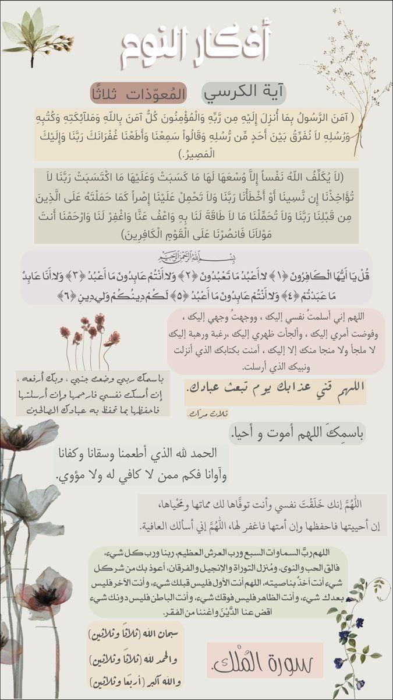

أذكار النوم | أحفظ الله يحفظك 🌿.

 كُل ليلة خُتمت بتلاوة سورة الملك ،بشر لصاحبها في حياته بعودة قلبه للفطرة، وفي الآخرة بشفاعتها له.. 

قال رسول الله ﷺ: «إِنَّ سُورَةً مِنَ القُرْآنِ ثَلاَثُونَ آيَةً شَفَعَتْ لِرَجُلٍ حَتَّى غُفِرَ لَهُ، وَهِيَ سُورَةُ تَبَارَكَ الَّذِي بِيَدِهِ المُلْكُ"))

وهي المنجية من عذاب القبر. 

- اذكار النوم يا رفاق🌿.